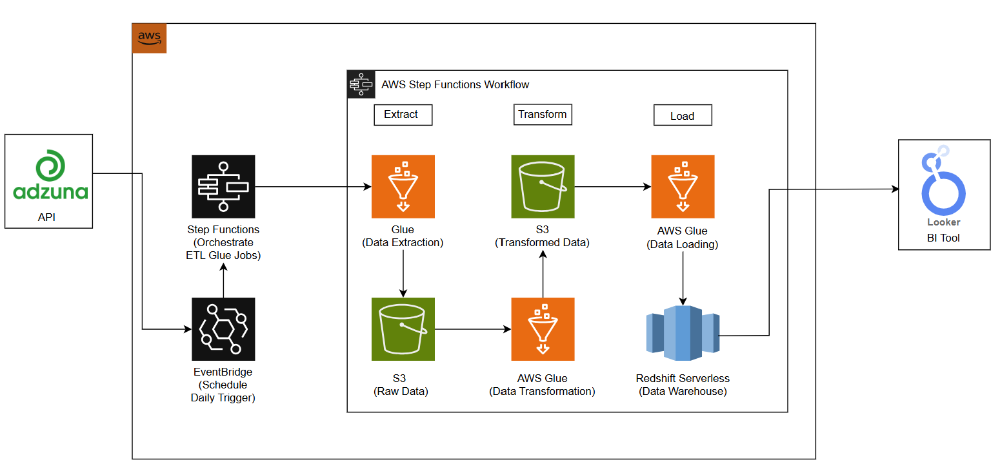
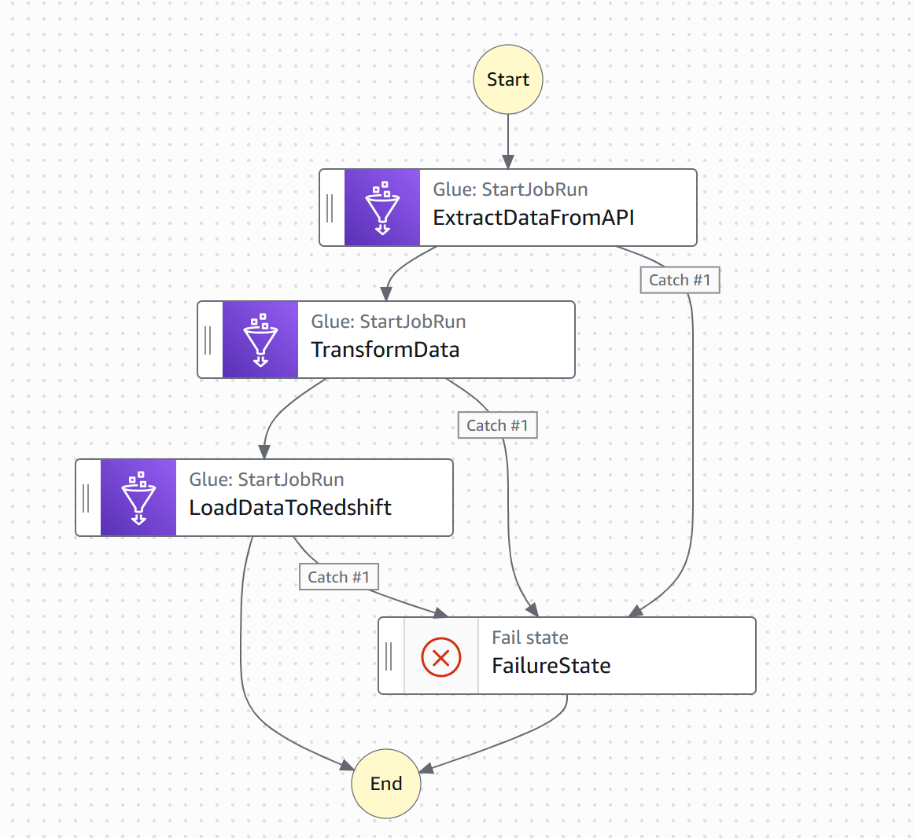
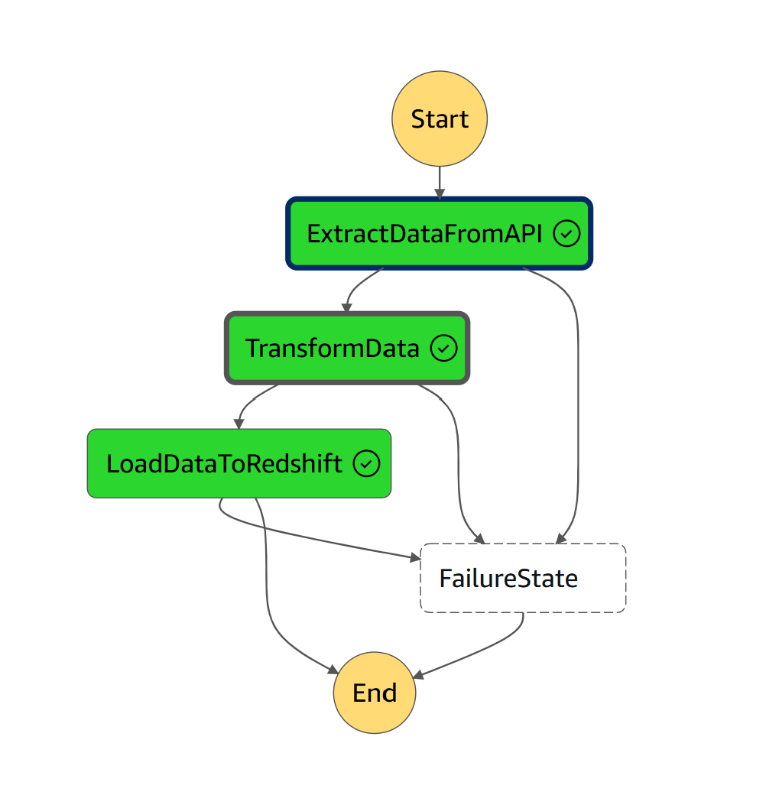
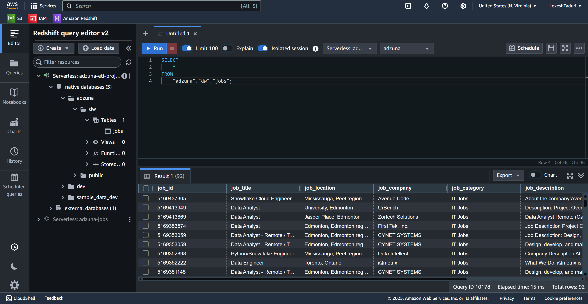
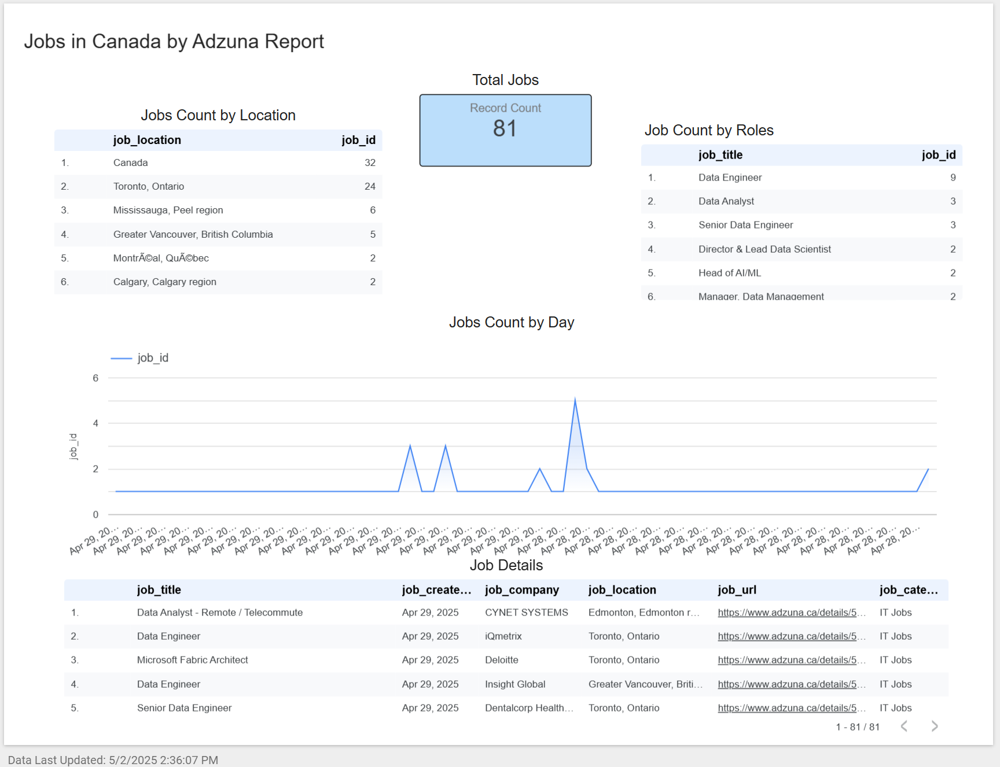

# From API to Dashboard: Building a Complete ETL Pipeline on AWS

This project shows how to build a full end-to-end data pipeline using **AWS services** — from collecting raw job data to displaying it in a dashboard. We are using live job listings from the **Adzuna API**, transforming and loading the data into **Amazon Redshift Serverless**, and creating interactive dashboards with **Looker Studio**.



## 🧭 Project Flow

This project follows these main steps:

### Step 1: Extract Data  
- We use **AWS Glue (Python Shell Job)** to collect job listing data from the Adzuna API.
- The raw data is saved in **Amazon S3**.

### Step 2: Transform Data  
- The raw data is cleaned and formatted using **AWS Glue PySpark Job**.
- The transformed data is stored again in S3.

### Step 3: Load Data  
- The final data is loaded from S3 into **Amazon Redshift Serverless**.
- A Redshift schema is defined using SQL scripts.

### Step 4: Visualize Data  
- The Redshift database is connected to **Looker Studio** (Google’s BI tool).
- Dashboards are created to show job trends, salaries, and top hiring cities for Data Engineers in Canada.

---

## ⚙️ Services Used

- **AWS Glue** (Python Shell + Spark Jobs)
- **Amazon S3**
- **Amazon Redshift Serverless**
- **AWS Step Functions** (to manage the ETL flow)
- **Amazon EventBridge** (to schedule jobs)
- **Looker Studio** (for reporting and dashboards)
- **Python**
- **Adzuna Job Search API**

---

> ✅ **Note:** All screenshots are placed in the appropriate folders with meaningful names so you can easily refer to them below.

---

## 🖼️ Visual Walkthrough

Below are some visuals to understand the process better:

- **Step Function Workflow**  
  
{:class="img-responsive"}
{:height="50%" width="50%"}
{:height="700px" width="400px"}

- **Execution Success Example**  
  

- **Data Loaded in Redshift**  
  

- **Final Looker Studio Dashboard**  
  

---

## 🚀 How to Run This Project

### 1. Clone This Repository

```bash
git clone https://github.com/your-username/aws-etl-project.git
cd aws-etl-project
